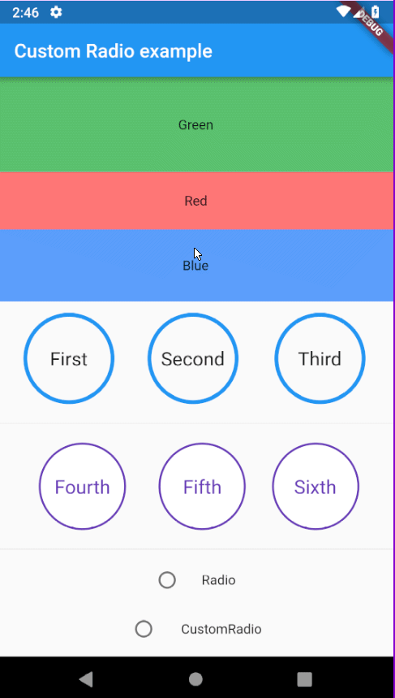
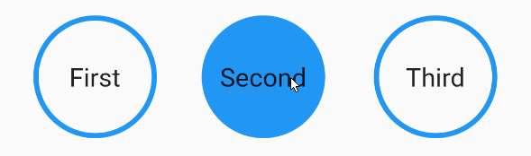
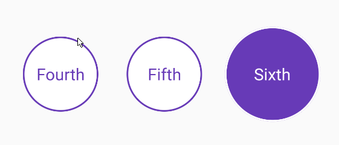
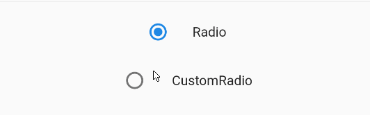

# custom_radio

A flexible and animatable radio button.

I found it strange that flutter only provides two radio widgets: __Radio__ and __RadioListTile__
The main issue with these widgets is that both of them force the use of the default Android leading animated circular icon.
The CustomRadio widget leaves everything up to the user by allowing them to provide their own builder function.
On top of that, an animations builder can also be provided. This gets passed a parent animation controller with which the user can then use to create a list of animations to animate the widget's transition between states.

# Installation
Simply add `custom_radio: ^0.1.3` as a dependancy in your pubspec.yaml file.
Then `import 'package:custom_radio/custom_radio.dart';` wherever it's needed.

# Examples


If only one animation type is required then it can be specified to enable stronger typing.
```
CustomRadio<String, double>(
  value: 'First',
  groupValue: widget.radioValue,
  duration: Duration(milliseconds: 500),
  animsBuilder: (AnimationController controller) => [
    CurvedAnimation(
      parent: controller,
      curve: Curves.easeInOut
    )
  ],
  builder: (BuildContext context, List<double> animValues, Function updateState, String value) {
    final alpha = (animValues[0] * 255).toInt();
    return GestureDetector(
      onTap: () {
        setState(() {
          widget.radioValue = value;
        });
      },
      child: Container(
        padding: EdgeInsets.all(32.0),
        margin: EdgeInsets.all(12.0),
        alignment: Alignment.center,
        decoration: BoxDecoration(
          shape: BoxShape.circle,
          color: Theme.of(context).primaryColor.withAlpha(alpha),
          border: Border.all(
            color: Theme.of(context).primaryColor.withAlpha(255 - alpha),
            width: 4.0,
          )
        ),
        child: Text(
          value,
          style: Theme.of(context).textTheme.body1.copyWith(fontSize: 24.0),
        )
      )
    );
  }
)
```


But any combination of animation types are supported.
```
CustomRadio<String, dynamic>(
  value: 'First',
  groupValue: widget.radioValue,
  animsBuilder: (AnimationController controller) => [
    CurvedAnimation(
      parent: controller,
      curve: Curves.easeInOut
    ),
    ColorTween(
      begin: Colors.white,
      end: Colors.deepPurple
    ).animate(controller),
    ColorTween(
      begin: Colors.deepPurple,
      end: Colors.white
    ).animate(controller),
  ],
  builder: (BuildContext context, List<dynamic> animValues, Function updateState, String value) {
    return GestureDetector(
      onTap: () {
        setState(() {
          widget.radioValue = value;
        });
      },
      child: Container(
        alignment: Alignment.center,
        margin: EdgeInsets.all(18.0),
        padding: EdgeInsets.all(32.0 + animValues[0] * 12.0),
        decoration: BoxDecoration(
          shape: BoxShape.circle,
          color: animValues[1],
          border: Border.all(
            color: animValues[2],
            width: 2.0
          )
        ),
        child: Text(
          value,
          style: Theme.of(context).textTheme.body1.copyWith(
            fontSize: 20.0,
            color: animValues[2]
          ),
        )
      )
    );
  },
)
```


You can even recreate the default animation provided by _Radio_ and add your own personal flairs!
Note: The full example can be found in the `example` directory
```
CustomRadio<int, double>(
  value: value,
  groupValue: widget.radioValue,
  duration: Duration(milliseconds: 400),
  animsBuilder: (AnimationController controller) => [
    CurvedAnimation(
      parent: controller,
      curve: Curves.ease
    )
  ],
  builder: ({ BuildContext context, List<double> animValues, Function updateState, bool checked }) {
    return GestureDetector(
      onTapDown: (TapDownDetails details) {
        setState(() {
          if (_controller.status != AnimationStatus.completed)
            _controller.forward();
        });
      },
      onTapUp: (TapUpDetails details) {
        setState(() {
          if (_controller.status != AnimationStatus.dismissed)
            _controller.reverse();
        });
      },
      onTap: () {
        setState(() {
          widget.radioValue = value;
        });
      },
      child: Container(
        margin: EdgeInsets.all(8.0),
        width: 38.0,
        height: 38.0,
        alignment: Alignment.center,
        decoration: BoxDecoration(
          shape: BoxShape.circle,
        ),
        child: Stack(
          alignment: Alignment.center,
          children: <Widget>[
            Container(
              width: 38.0 * _animation.value,
              height: 38.0 * _animation.value,
              decoration: BoxDecoration(
                shape: BoxShape.circle,
                color: Theme.of(context).primaryColor.withAlpha(40)
              ),
            ),
            Container(
              width: 18.0,
              height: 18.0,
              decoration: BoxDecoration(
                shape: BoxShape.circle,
                color: Colors.transparent,
                border: Border.all(
                  color: checked ? Theme.of(context).primaryColor : Theme.of(context).hintColor,
                  width: 2.0
                )
              ),
            ),
            Container(
              width: 11.0 * animValues[0],
              height: 11.0 * animValues[0],
              decoration: BoxDecoration(
                shape: BoxShape.circle,
                color: Theme.of(context).primaryColor,
              ),
            ),
          ]
        ),
      )
    );
  }
)
```

